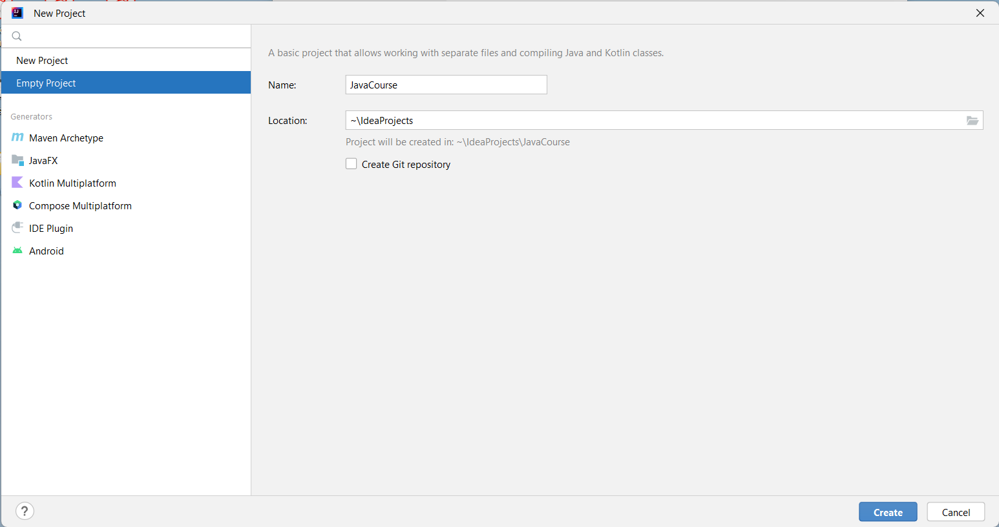
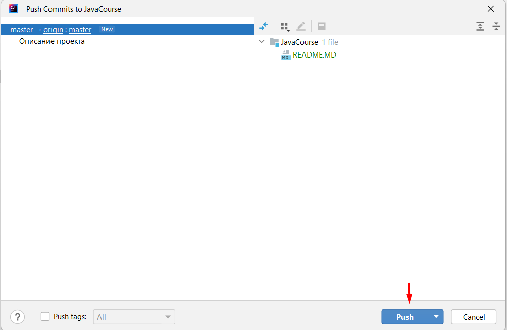
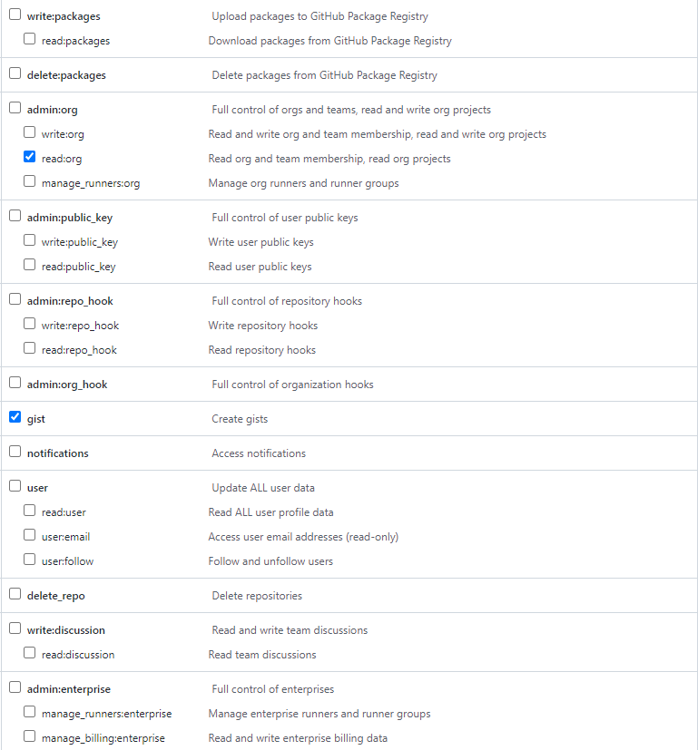

# Предварительная подготовка
1. Регистрируемся на [GitHub](https://github.com/)
2. [Устанавливаем Notepad++ и Git](tools/README.md)
3. Устанавливаем [IntelliJ IDEA](https://www.jetbrains.com/ru-ru/idea/download/#section=windows)
5. Устанавливаем [JDK 11 LTS от BellSoft](https://bell-sw.com/pages/downloads/)

# Создание проекта в IntelliJ IDEA
1. Создаем новый проект. Нажимаем `New Project`

2. Выбираем `Empty Project`. Задаем имя проекта. Например, `JavaCourse`

3. Открываем настройки Idea. `File -> Settings...`

4. Переходим в раздел `Editor -> File Encodings`

5. Меняем кодировку на UTF-8. Нажимаем кнопку OK

6. Создаем новый файл `README.md` в корне проекта

8. Меняем режим отображения файла `README.md`

9. Формируем описание репозитория. Например, указываем текст `Задачи по Java`

10. Открываем терминал

11. Создаем новый репозиторий командой `git init`

12. Настраиваем имя пользователя `git config --local user.name "Фамилия Имя"`

13. Указываем свою почту `git config --local user.email "test@gmail.com"`

14. Заходим на `GitHub` и создаем новый репозиторий

15. Задаем имя репозитория, делаем его приватным, нажимаем на кнопку `Create repository`

16. Появится окно с инструкциями. Копируем указанную инструкцию

17. Вставляем инструкцию в терминал и нажимаем `Enter`

18. Коммитим файл `README.md`

19. Оставляем комментарий к коммиту. Например, `Описание проекта`. Нажимаем `Commit and Push`

20. Откроется окно, в котором проверяем список файлов для коммита и затем нажимаем `Push`

21. Появится окно для выбора способа авторизации на GitHub. Выбираем `Use Token...`

22. Нажимаем `Generate...`. Откроется страница с генерацией токена на GitHub

23. Выполняем настройку токена. В поле `Expiration` выбираем `No expiration`. Остальные настройки оставляем по умолчанию

26. Сохраняем токен в какой-нибудь файл. После обновления страницы на GitHub'е токен отображаться не будет

27. Вставляем токен и нажимаем кнопку `Log In`

28. Происходит push в репозиторий. После завершения push'a - можно обновить репозиторий на Github. В нем будет присутствовать файл README.md

# Создание структуры проекта

1. Создаем каталог `src`

2. Создаем структуру каталогов, как на рисунке

3. Помечаем каталог `src`, как корень исходных файлов

4. Создаем файл `Main.java`

5. Нажимаем `Cancel`

6. Помещаем решение первой задачи в `Main.java`

7. Создавем новую ветку от ветки **master**

8. Называем ветку `task1`. Ветки для других задач называем по аналогии `task2`, `task3` ...

9. Коммитим директорию `task1`

10. Выбираем файл для коммита `Main.java`. Оставляем комментарий к коммиту и нажимаем на кнопку `Commit and Push...`

11. Нажимаем кнопку `Push`

12. Доработки запушены в ветку `task1`

# Создание Pull Request'a

1. Добавляем ревьюверов к репозиторию. Как минимум - Антонова Сергея (AntonovCode). **Ревьювер должен принять приглашение. Только после этого создаем
какие-либо Pull Request'ы.**

2. После Push'a доработок заходим в раздел `Pull requests` и нажимаем на кнопку `New pull request`

3. Выбираем ветку, которую хотим слить в `master`. В данном примере `task1`.

4. Нажимаем на кнопку `Create pull request`.

5. На этапе создания PR оставляем комментарии, если необходимо. Добавляем ревьюверов. Нажимаем кнопку `Create pull request`

6. Pull Request создан. Ревьюверу придет оповещение на почту