# Установка инструментов

1. [Установка Notepad++](#установка-notepad)

2. [Установка и настройка Git](#установка-и-настройка-git)

# Установка Notepad++

1. Переходим на [страницу загрузки Notepad++](https://notepad-plus-plus.org/downloads/)
и скачиваем последнюю версию.

2. Запускаем установочный файл. Все настройки оставляем по умолчанию. 
Устанавливаем.

# Установка и настройка Git

1. Скачаем и запускаем установочный файл с сайта 
[Git SCM](https://git-scm.com/downloads).

2. В окне с лицензией нажимаем `Next`.

    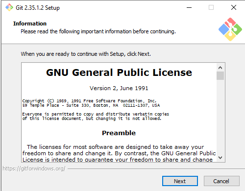

3. В окне выбора установочного каталога оставляем все по умолчанию, нажимаем 
`Next`.

    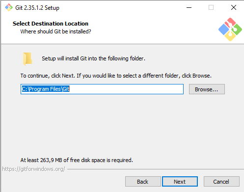

4. В окне выбора компонентов оставляем все по умолчанию, нажимаем 
`Next`.

    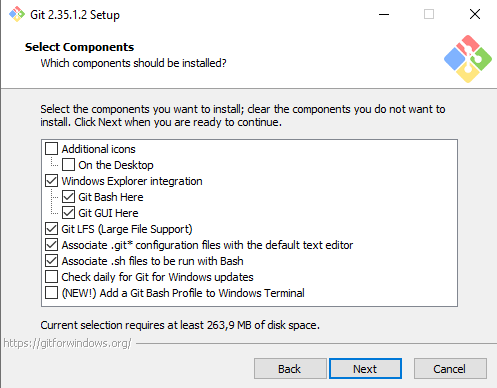

5. В окне задания названия для стартового меню оставляем все по умолчанию, 
нажимаем `Next`.

    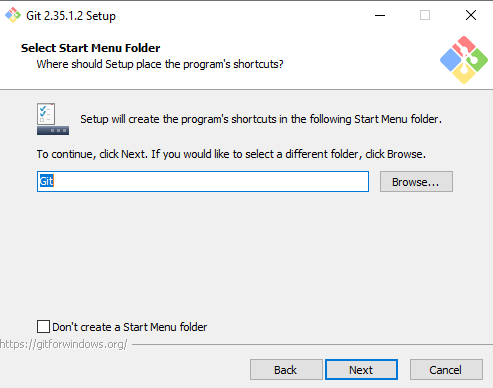

6. В окне выбора текстового редактора переключаемся на использование Notepad++,
нажимаем `Next`.

    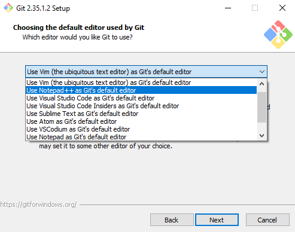

7. В окне выбора наименования стартовой ветки оставляем все по умолчанию, 
нажимаем `Next`.

    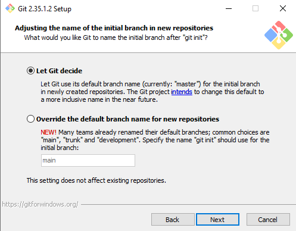

8. В окне настройки переменной окружения PATH оставляем все по умолчанию, 
нажимаем `Next`.

    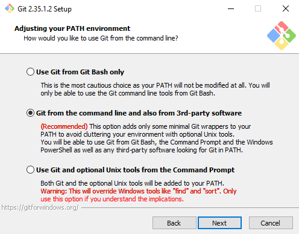

9. В окне настройки SSH оставляем все по умолчанию, нажимаем `Next`.

    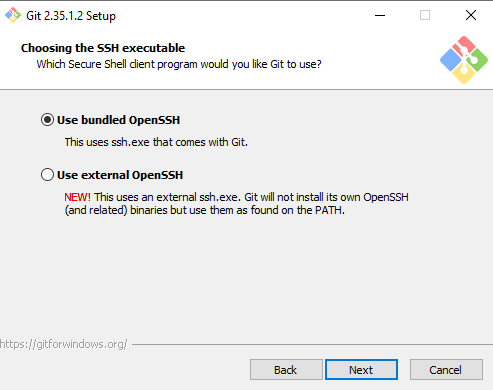

10. В окне выбора библиотеки SSH оставляем все по умолчанию, нажимаем `Next`.

    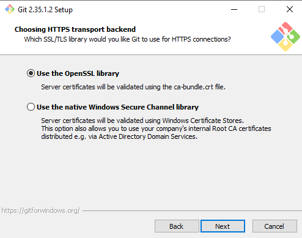

11. В окне выбора окончания текстовых файлов оставляем все по умолчанию, 
нажимаем `Next`.

    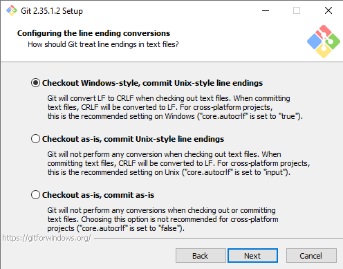

12. В окне выбора эмулятора в git bash оставляем все по умолчанию, 
нажимаем `Next`.

    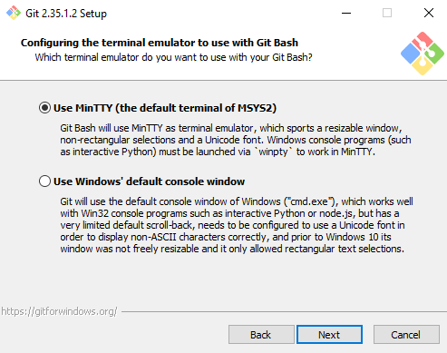

13. В окне настройки git pull оставляем все по умолчанию, 
нажимаем `Next`.

    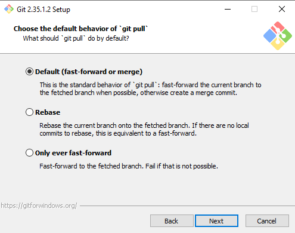

14. В окне настройки Git Credential Helper выбираем `None`, нажимаем `Next`.

    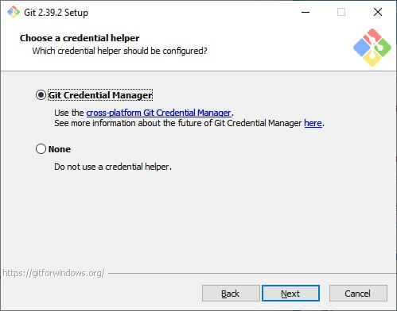

15. В окне настройки дополнительных опций оставляем все по умолчанию, 
нажимаем `Next`.

    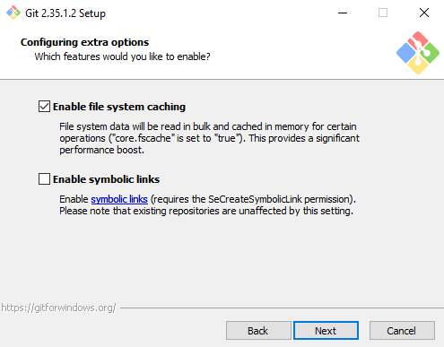

16. В окне настройки экспериментальных опций оставляем все по умолчанию, 
нажимаем `Install`.

    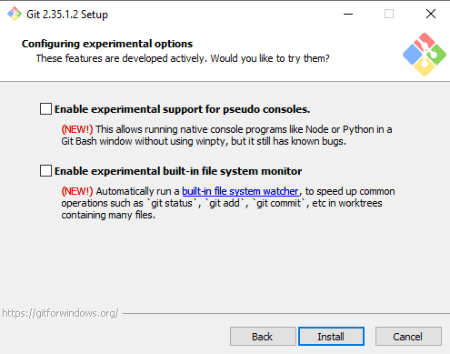